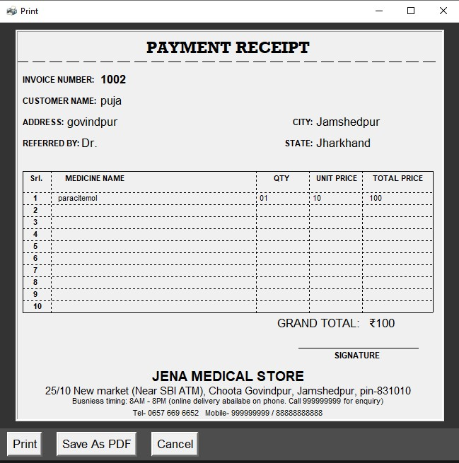

# MEDICAL BILLING SYSTEM


[](https://travis-ci.org/joemccann/dillinger)

This is developed for demo and educational purpose. Contact below for any querry

  - sridhwork@gmail.com


### Features

  - Create Invoices
  - Print invoices
  - Save invoices into your local storage

### Installation

**This is the guide for windows systems
- Install python >=3.7
```sh
$ choco install python
```
- Install Ghostscript >=9.5
```sh
$ choco install ghostscript
```
- Install pillow module
```sh
$ pip install pillow
```
- install mysql connector
```sh
$ pip install mysql-connector
```
- install ghostscript
```sh
$ pip install mysql-connector
```


### Todos

 - Clone all the files
 - To change theme change (window.configure(bg="gray16")) to any supported color

License
----

MIT

## SCREENSHOTS

***Main Page of the Application***


***Connection window to configure SQL database connection***


***Receipt Preview Window***




***Saving PDF of invoice***


**Free Software, Hell Yeah!**

[//]: # (These are reference links used in the body of this note and get stripped out when the markdown processor does its job. There is no need to format nicely because it shouldn't be seen. Thanks SO - http://stackoverflow.com/questions/4823468/store-comments-in-markdown-syntax)


   [dill]: <https://github.com/joemccann/dillinger>
   [git-repo-url]: <https://github.com/joemccann/dillinger.git>
   [john gruber]: <http://daringfireball.net>
   [df1]: <http://daringfireball.net/projects/markdown/>
   [markdown-it]: <https://github.com/markdown-it/markdown-it>
   [Ace Editor]: <http://ace.ajax.org>
   [node.js]: <http://nodejs.org>
   [Twitter Bootstrap]: <http://twitter.github.com/bootstrap/>
   [jQuery]: <http://jquery.com>
   [@tjholowaychuk]: <http://twitter.com/tjholowaychuk>
   [express]: <http://expressjs.com>
   [AngularJS]: <http://angularjs.org>
   [Gulp]: <http://gulpjs.com>

   [PlDb]: <https://github.com/joemccann/dillinger/tree/master/plugins/dropbox/README.md>
   [PlGh]: <https://github.com/joemccann/dillinger/tree/master/plugins/github/README.md>
   [PlGd]: <https://github.com/joemccann/dillinger/tree/master/plugins/googledrive/README.md>
   [PlOd]: <https://github.com/joemccann/dillinger/tree/master/plugins/onedrive/README.md>
   [PlMe]: <https://github.com/joemccann/dillinger/tree/master/plugins/medium/README.md>
   [PlGa]: <https://github.com/RahulHP/dillinger/blob/master/plugins/googleanalytics/README.md>
